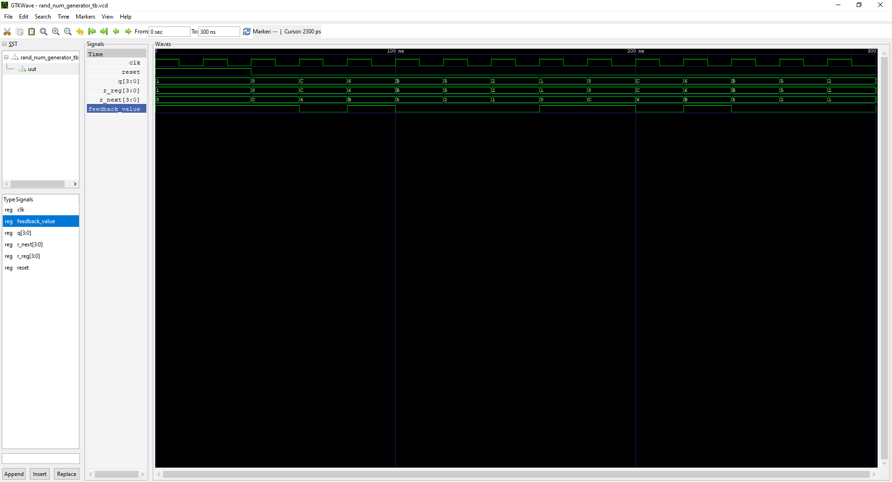

###### I pledge my honor that I have abided by the Stevens Honor System. @Calvin Zheng

# Assignment 1: VHDL Modeling
1. Find a VHDL model not included in the course material
2. Add a comment citing the source
3. Upload the VHDL file to the GitHub repository

Program Outcome 1: (*Complex Problem Solving*)

2.1 The student will be able to apply VHDL entity/architecture modeling to represent component inputs and outputs and also internal signals, variables, and operations.

### Submission: Please see file [rand_num_generator.vhd](./rand_num_generator.vhd)
###### Note: 'clockTick.vhd' and 'modMCounter.vhd' are included in the directory as they are required files for this example.

# Assignment 2: VHDL Test Bench
1. Develop a test bench for a design in VHDL 
2. Add a comment citing the source
3. Run GHDL to generate a VCD file
4. Use GTKWave to view the VCD file and take a screen shot
5. Upload the design, test bench, and VCD files to the GitHub repository
6. Create a README.md to include the screen shot
 

Program Outcome 2: (*Design*)

2.5 The student will be able to write test vectors for a digital system and develop a VHDL test-bench to apply these vectors using file based input/output operations.

### Submission: Please see file [rand_num_generator_tb.vhd](./rand_num_generator_tb.vhd)
###### Note: 'clockTick.vhd' and 'modMCounter.vhd' are included in the directory as they are required files for this example. 
To compile test bench, first analyze `modMCounter.vhd`, `clockTick.vhd`, and `rand_num_generator.vhd` with GHDL, in that order, using `ghdl -a [file]`. Then proceed to analyze, elaborate, and run `rand_num_generator_tb.vhd` to generate the VCD file.

