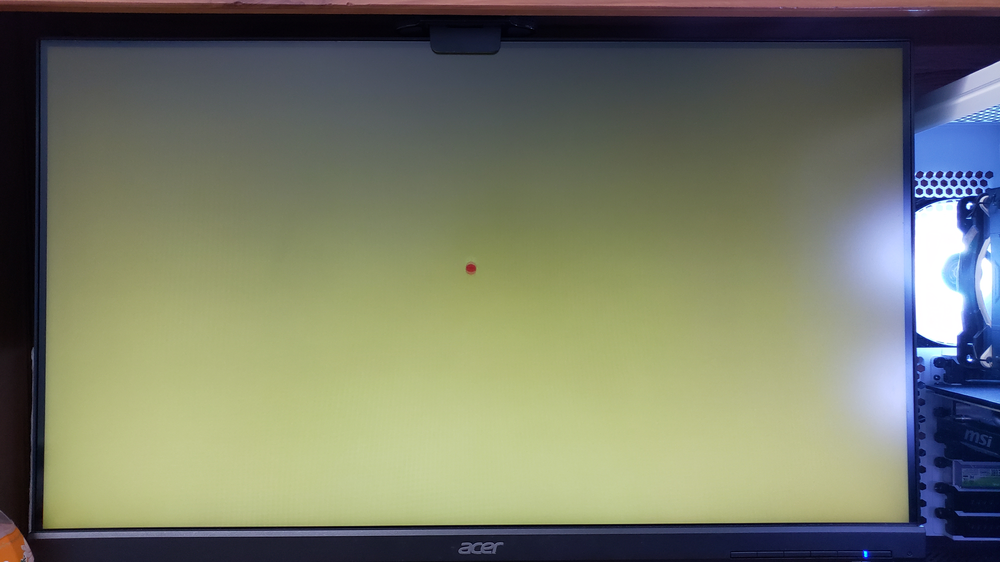
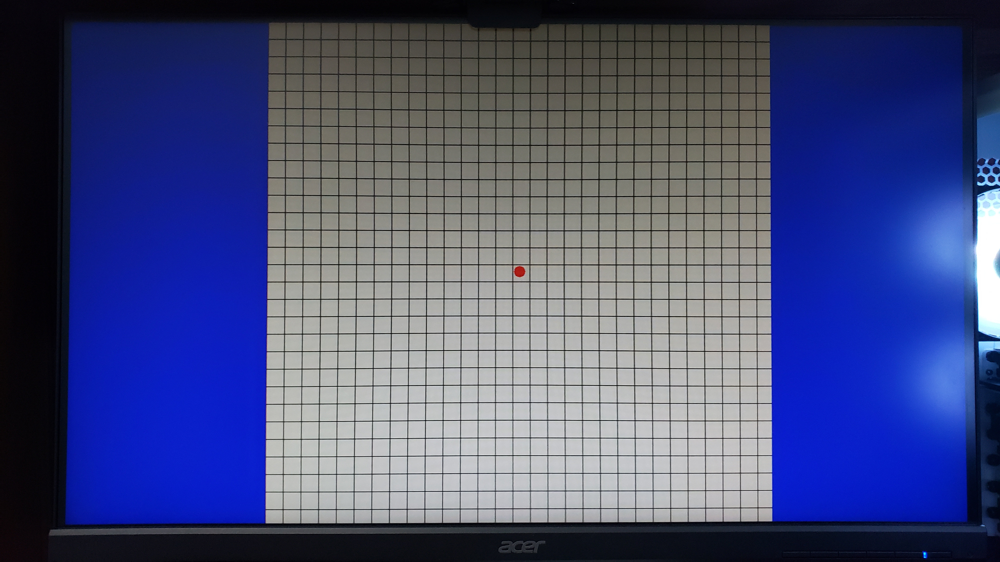

# Final Project: MazeGame

In this project, I decide to recreate a maze game using an FPGA board, more specifically the [NI Digilent Nexys A7-100T FPGA Trainer Board](https://digilent.com/reference/programmable-logic/nexys-a7/start?redirect=1).

## Concept
1. Generate a maze map
2. Allow users to control a ball that would move through the maze
3. Upon reaching the end, move on to the next level
4. After finishing all made levels, present an end screen

## Steps
### 1. Getting a VGA signal to display on a montior
###### Note: Unfortunately, I do not have a VGA monitor so I used an [High-Definition Multimedia Interface](https://en.wikipedia.org/wiki/HDMI) (HDMI) monitor instead. Therefore, using a [VGA-to-HDMI converter](https://www.ventioncable.com/product/vga-to-hdmi-converter/) with a [micro-B USB](https://en.wikipedia.org/wiki/USB_hardware) power supply, I connected the Digilent Nexys A7-100T board to the HDMI monitor to see the generated output. 
###### Another note: Due to the short length of the USB to micro-B USB cable, I connected it directly into the FPGA board for power since I am not using the USB port on the board for this project.
The first step was to get VGA working on a standard monitor. For this, I referred to [Lab 3: Bouncing ball](../Assignments/Assignment%205%20-%20Vivado%20Labs%203%20and%206) as a base to get a VGA output as well as a red ball. However, the VGA output in that was 800x600@60Hz, so I decided to modify the timing info in the ***vga_sync*** and ***clk_wiz_0_clk_wiz*** modules to output in 1280x720@60Hz. **Many thanks to Peter Ho @PeterHo8888 (https://github.com/PeterHo8888) for helping me figure out the necessary timings and modifications for this transition.**

### 2. Adding functions to the onboard buttons (making the ball move) and collision detection
Now that I have the VGA output in 1280x720@60Hz and a ball, I need to make the ball move to the onboard buttons on the FPGA board so the user can control the ball's movement. I also wanted to fix the ugly green background this has and make it white. 

To accomplish this, I added 5 new ports and linked them to the board in the constraints file to be mapped onto the 5 onboard buttons I wanted to use. Then inside `ball.vhd` I added the 5 ports and used them as conditions to test for which button is being pressed, then move the ball in the corresponding direction by updating its position at every frame. 4 of the buttons were used for the 4 directions, the 5th button (center button) was used as an "interact" button, which I can use to do various things. For now, I have it set to map the ball to the center of the screen. I also fixed up the the green background by changing the bit size of the RGB vectors. They were originally 3, 3, and 2 bits for R, G, and B respectively, probably for an older board which had limited VGA bits. Since the Artix-7 has the full 4 bits per color, changing each RGB vector to be 4 bits long fixed the issue. This required modifications in `vga_sync` as well as the original declarations in `MazeGame.vhd`. This entire process took about 30 to 45 minutes.

Now the fun stuff: collision detection. Without collision detection, the ball is able to freely move off the screen (and go through walls later when I actually make the maze map). The original idea was to just reverse the velocity of the ball when it hits the side of the screen. While this works, it produces a bouncing effect. It would be nicer if the ball would just stop and stay on the wall... so I tired to set the position to be by the wall and velocity to be 0 if collision is detected. After several variations, the ball would either be lodged into the wall or be bouncing because I set the position too far back. The issue here, is that the ball's position is being set both before and after the collision check. It's being set after every computation rather than once at the end. Therefore, I had to create integer variables, which would be the placeholder to calculate the intended position of the ball, then if there is a collision, set the intended position to be against the wall, then at the end of the process map the ball to set coordinates.

***TDLR:*** *The original movement process of the ball sets the ball's position after every calculation. I created variables within the process so the ball's intended position could be calculated first, then mapped once at the end of the process rather than constantly being changed throughout the process. This eliminates the bouncing effect against walls.*

###### Note: I noticed that the timings on the VGA output was slightly off and had to be altered.

### 3. Creating the maze map (initial grid)
With the ball movement working properly, the next step is to create the map of the maze that will be played. To do this, I decided to first create an initial grid, which will later be filled in by black squares, which will act as "walls" for the maze. To do this, I created a new design source, `mazeMap.vhd`, where I define what the VGA output would be for the map. I was overthinking this entire process for a while, which was why it took me a while to figure out this simple step.

A small mistake that took up a lot of time: **[Sensitivity List](https://www.ics.uci.edu/~jmoorkan/vhdlref/process.html)**. When I was writing the process to draw the grid, I did not put the pixel positions in the sensitivty list of the process and therefore the RGB outputs for the map was not being re-evaluated for each pixel. For the longest time I thought my *if* conditions were incorrect and I was testing each variation of the *if* conditions just to see no changes.

A problem with the original design from step 2 was that there was only one set of signals that link to the VGA output, so I had to create two separate signals (one for the ball one for the map) to separate the desired RGB values for each component. In addition, to figure out which component's color to output, I had to map a new out port from `ball.vhd` to get the `ball_on` signal which tells us if the current pixel is on the ball or not. If so, use the ball's color, otherwise use the map's color.

At long last, the resulting output is generated and shown in the image below:

### 4. Filling in the maze map