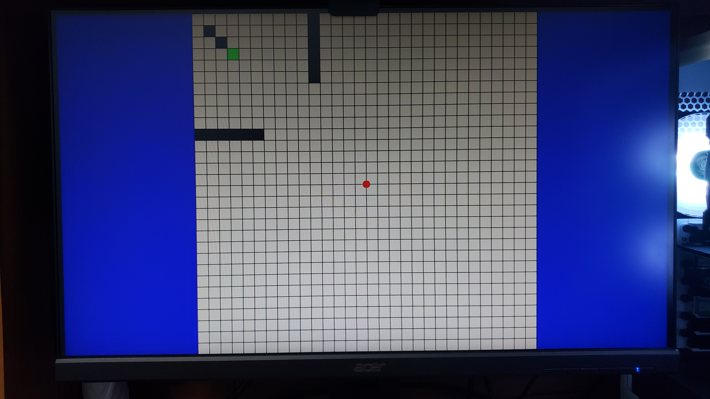
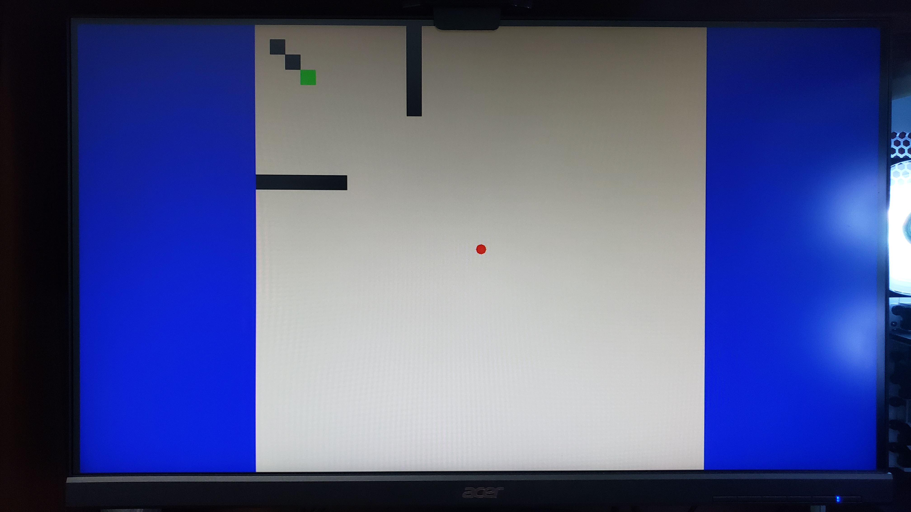

# Final Project: MazeGame

In this project, I decide to recreate a maze game using an FPGA board, more specifically the [NI Digilent Nexys A7-100T FPGA Trainer Board](https://digilent.com/reference/programmable-logic/nexys-a7/start?redirect=1).

## Concept
1. Create a set of maze levels
2. Allow users to control a ball that would move through the maze
3. Upon reaching the end, move on to the next level
4. After finishing all made levels, go back to the start

## Steps
### 1. Getting a VGA signal to display on a montior
###### Note: Unfortunately, I do not have a VGA monitor so I used an [High-Definition Multimedia Interface](https://en.wikipedia.org/wiki/HDMI) (HDMI) monitor instead. Therefore, using a [VGA-to-HDMI converter](https://www.ventioncable.com/product/vga-to-hdmi-converter/) with a [micro-B USB](https://en.wikipedia.org/wiki/USB_hardware) power supply, I connected the Digilent Nexys A7-100T board to the HDMI monitor to see the generated output. 
###### Another note: Due to the short length of the USB to micro-B USB cable, I connected it directly into the FPGA board for power since I am not using the USB port on the board for this project.
The first step was to get VGA working on a standard monitor. For this, I referred to [Lab 3: Bouncing ball](../Assignments/Assignment%205%20-%20Vivado%20Labs%203%20and%206) as a base to get a VGA output as well as a red ball. However, the VGA output in that was 800x600@60Hz, so I decided to modify the timing info in the ***vga_sync*** and ***clk_wiz_0_clk_wiz*** modules to output in 1280x720@60Hz. **Many thanks to Peter Ho @PeterHo8888 (https://github.com/PeterHo8888) for helping me figure out the necessary timings and modifications for this transition.**

### 2. Adding functions to the onboard buttons (making the ball move) and collision detection
Now that I have the VGA output in 1280x720@60Hz and a ball, I need to make the ball move to the onboard buttons on the FPGA board so the user can control the ball's movement. I also wanted to fix the ugly green background this has and make it white. 

To accomplish this, I added 5 new ports and linked them to the board in the constraints file to be mapped onto the 5 onboard buttons I wanted to use. Then inside `ball.vhd` I added the 5 ports and used them as conditions to test for which button is being pressed, then move the ball in the corresponding direction by updating its position at every frame. 4 of the buttons were used for the 4 directions, the 5th button (center button) was used as an "interact" button, which I can use to do various things. For now, I have it set to map the ball to the center of the screen. I also fixed up the the green background by changing the bit size of the RGB vectors. They were originally 3, 3, and 2 bits for R, G, and B respectively, probably for an older board which had limited VGA bits. Since the Artix-7 has the full 4 bits per color, changing each RGB vector to be 4 bits long fixed the issue. This required modifications in `vga_sync` as well as the original declarations in `MazeGame.vhd`. This entire process took about 30 to 45 minutes.

Now the fun stuff: collision detection. Without collision detection, the ball is able to freely move off the screen (and go through walls later when I actually make the maze map). The original idea was to just reverse the velocity of the ball when it hits the side of the screen. While this works, it produces a bouncing effect. It would be nicer if the ball would just stop and stay on the wall... so I tired to set the position to be by the wall and velocity to be 0 if collision is detected. After several variations, the ball would either be lodged into the wall or be bouncing because I set the position too far back. The issue here, is that the ball's position is being set both before and after the collision check. It's being set after every computation rather than once at the end. Therefore, I had to create integer variables, which would be the placeholder to calculate the intended position of the ball, then if there is a collision, set the intended position to be against the wall, then at the end of the process map the ball to set coordinates.

***TDLR:*** *The original movement process of the ball sets the ball's position after every calculation. I created variables within the process so the ball's intended position could be calculated first, then mapped once at the end of the process rather than constantly being changed throughout the process. This eliminates the bouncing effect against walls.*

###### Note: I noticed that the timings on the VGA output was slightly off and had to be altered.

### 3. Creating the maze map (initial grid)
With the ball movement working properly, the next step is to create the map of the maze that will be played. To do this, I decided to first create an initial grid, which will later be filled in by black squares, which will act as "walls" for the maze. To do this, I created a new design source, `mazeMap.vhd`, where I define what the VGA output would be for the map. I was overthinking this entire process for a while, which was why it took me a while to figure out this simple step.

A small mistake that took up a lot of time: **[Sensitivity List](https://www.ics.uci.edu/~jmoorkan/vhdlref/process.html)**. When I was writing the process to draw the grid, I did not put the pixel positions in the sensitivty list of the process and therefore the RGB outputs for the map was not being re-evaluated for each pixel. For the longest time I thought my *if* conditions were incorrect and I was testing each variation of the *if* conditions just to see no changes.

A problem with the original design from step 2 was that there was only one set of signals that link to the VGA output, so I had to create two separate signals (one for the ball one for the map) to separate the desired RGB values for each component. In addition, to figure out which component's color to output, I had to map a new out port from `ball.vhd` to get the `ball_on` signal which tells us if the current pixel is on the ball or not. If so, use the ball's color, otherwise use the map's color.

At long last, the resulting output is generated and shown in the image below:

### 4. Filling in the maze map (a.k.a level making)
Now, with the grid working, I want to begin filling in each cell with respective colors to represent components of the maze. I also wanted to make this process as abstract as possible so that level making and editing, as well as attaching multiple levels to the game very easy to do down the line. To do this, I created a new design source, `level0.vhd`, where I will define the characteristics of the level such as cell size and starting/ending pixels as well as the components that are in each cell. Instead of defining each of the 720x720 pixels the screen, I mapped each cell area to a pixel at the cell's corner using integer math. Therefore, to define the whole map, I would only have to define the NxN cell corners that make up the grid (in this case, 30x30). Thank you @PeterHo8888 for helping me understand this concept.

Within each of the cells, I would define a 2-bit `std_logic_vector` that would define what component is at that cell. In this case, I have mapped `00 = nothing (default); 01 = wall; 10 = exit`. More bits can be added downt the line in the case that more components need to be added to the game. To create and edit the maze map, the programmer would just have to specify what each cell is in the 2D array of cells.

Then, `level0.vhd` would output the map information to the top level, which gets passed along to `mazeMap.vhd` where the map gets drawn and the correct RGB signals are set and passed to the VGA output. `mazeMap.vhd` is also where the colors for each component is specified.

The sample map I have made for testing purposes is shown in the image below:

Then, once you remove the grid from the map (just do not draw the grid to begin with), it looks like this:

### 5. Ball collision and interaction with components
Almost at the end now. This next step involves getting the ball to detect collisions with the components on the pre-defined map. The setup from the previous step would not work, since there are no signals being ported into `ball.vhd` that would allow the ball to "see" what it is running into. Therefore, I had to restructure the project. At the top level, in `MazeGame.vhd`, I now define a package that would include the definition for the type `cell_matrix` which is the N by N 2D array of cells mentioned in the previous step. This package gets extended to each of the project's modules for use. This way, the level modules can define its cell array and pass it to other modules *as a whole* through the top level.

This allowed for several changes:
1. Now, the level modules do not have to port out a 2-bit `std_logic_vector` defining what component is at the current pixel -- instead it passes out the entire array for all of the other modules to use.
	1. This also means that now the level modules include strictly the maze definitions and does no calculations whatsoever.
2. The `mazeMap.vhd` module now does the integer math for itself to map cell areas to their respective corners before determining what RGB signals are to be sent for each pixel.
3. The `ball.vhd` module now has access to the entire cell array and will now be able to determine if the ball collides with other components of the maze.

The first issue that I ran into while performing these changes was that at the top level, `MazeGame.vhd`, if I want to pass the cell array to other modules, I would have to initialize a signal of the same exact type. The original plan was that I would be able to incorporate levels of different grid/cell sizes as the game progressed. However, since this is still hardware, the signal I declare at the top level to pass the array must be of a constant size and must be the same size as the cell array declared in the level definition. Since I have no way of passing a constant from the level module to the top level, the array size must be hard-coded at the top level to match that of the level module (unfortunately). 

The next issue that I ran into was that in trying to implement ball collision with walls, somehow the ball's initial position was thrown off. What fixed this in the end was to first convert the `std_logic_vector` map information into constant integers that are declared in the architecture of the module, then using these constant integers to perform signal/variable calculations instead of keeping the map information as `std_logic_vector` signals.

The idea behind the ball collision is to check if any of the 4 edge pixels -- left, right, up, and down -- get mapped onto a component in the cell array. If it does, then perform appropriate actions. Although a slight offset is required for the top and left edges, the collision did end up working and the ball stops upon hitting a wall. While I did not yet code level transition for when the ball reaches an exit, since wall collision works it is safe to assume that the ball is able to detect collision with any component defined in the cell array.

**NOTE: There are some known issues/bugs with the current setup, but it should not affect the way MazeGame is played. The issues are as such:**
1. *If the ball is against a "wall" component and the user continues to press the same directional button repeatedly, the ball will clip into the "wall" slightly, but stop at a certain point.*
	1. Should not affect the game since the ball is unable to completely go through the "wall" and must go in the opposite direction to get out of the "wall." Unfortunately, I am unsure of why this is possible and can not suggest a fix at the moment.
2. *Since only the 4 edge pixels of the ball are being checked, the ball is able to visually slide into the "wall" at corners if the edge pixel that is being checked is just slightly above the "wall".*
	1. Again, the ball is still unable to completely go through such "walls", thus this shouldn't be an issue. To fix this, the module would have to check every pixel along the ball's edge (which would be tedious).
3. *If the movement buttons are pressed in a certain manner, the ball is sometimes able to move diagonally and is able to bypass all components*
	1. Unfortunately, I am also unsure of why this is possible since I have made the motion `if` conditions strict. Only when one button is pressed and the other three are not should the ball gain motion in the corresponding direction. Usually, entering and exiting this "diagonal" state is hard to control and the user would most likely have to reset the ball's position to continue playing.

The result are as such:

### 6. Level Transition
The final stretch of this project is to implement level transition. There was a reason why I implemented the "exit" component into the maze map -- so that the player can play multiple pre-made levels of the game. I have created a second level, called `level1.vhd`, using a [30x30 hedge maze](https://www.reddit.com/r/dndmaps/comments/inphp7/hedge_maze_30x30/) that I found online as reference. Thanks to my prior level making implementation, creating this new level was trivial (just denote which cells are what component). 

To add this new level into the project, I had to create separate signals for each level, as well as a level counter to determine which level's signals are to be passed onto the other modules (namely `mazeMap.vhd` and `ball.vhd`). This part was quite simple and I did not run into any issues along the way. I did this same thing to determine which pixels are to be drawn as the ball and which are to be drawn as the map earlier in this project. The only "setback" I encountered was due to me accidentally assigning the wrong signal to a port (`start_x_0` instead of `start_y_0` into `start_y_pass`), which resulted in the wrong output and had me thinking that there was a bug with this portion when there was not.

Since the collision aspect is tied to the ball itself, the "real" level counter would have to be a out signal from `ball.vhd`, which on the surface does not seem like too much of a problem. Just create an `std_logic_vector` signal (called `level_count`) that increments when the ball collides with an exit cell and output the signal to the top level to change which level's signals are being ported in. However, since signals do not get updated until the process is finished, I could not reset the ball to its intended initial position at the new level (because the new initial positions do not come in until the next cycle). I originally wanted to create a separate process that would initialize the ball's position when the level counter changed, but the problem with that was I could not use assignments of the same signals in different processes. The solution I came up with was to create a second level counter signal (called `level_count_old`) and an `if` statement such that if the two counters are not equal, then initialize the ball's position and then assign the first counter to the second (so that they are equal again). This would allow the intended positions to be ported in after the first process, then automatically reset the ball's position in the next process.

Finally, I also added an extra button, CPU_RESET, to allow the player to return to level0. I initially did not know that the signal for this button is *inversed* compared to the rest, so I had a little bit of trouble until I figured that out.

And with that, MazeGame is fully functional!

###### NOTE: I did consider also implementing text popup on the levels to show instructions on how to play, what level the player is currently on, and how much time has passed, but decided against it due to time constraints.

###### Documentation on how to implement new levels and how to play MazeGame are in the other Markdown files in this repository.