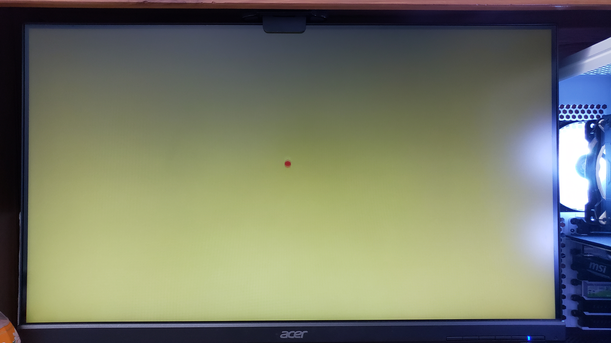

# Final Project: MazeGame

In this project, I decide to recreate a maze game using an FPGA board, more specifically the [NI Digilent Nexys A7-100T FPGA Trainer Board](https://digilent.com/reference/programmable-logic/nexys-a7/start?redirect=1).

## Concept
1. Generate a maze map
2. Allow users to control a ball that would move through the maze
3. Upon reaching the end, move on to the next level
4. After finishing all made levels, present an end screen

## Steps
### 1. Getting a VGA signal to display on a montior
###### Note: Unfortunately, I do not have a VGA monitor so I used an [High-Definition Multimedia Interface](https://en.wikipedia.org/wiki/HDMI) (HDMI) monitor instead. Therefore, using a [VGA-to-HDMI converter](https://www.ventioncable.com/product/vga-to-hdmi-converter/) with a [micro-B USB](https://en.wikipedia.org/wiki/USB_hardware) power supply, I connected the Digilent Nexys A7-100T board to the HDMI monitor to see the generated output. 
###### Another note: Due to the short length of the USB to micro-B USB cable, I connected it directly into the FPGA board for power since I am not using the USB port on the board for this project.
The first step was to get VGA working on a standard monitor. For this, I referred to [Lab 3: Bouncing ball](../Assignments/Assignment%205%20-%20Vivado%20Labs%203%20and%206) as a base to get a VGA output as well as a red ball. However, the VGA output in that was 800x600@60Hz, so I decided to modify the timing info in the ***vga_sync*** and ***clk_wiz_0_clk_wiz*** modules to output in 1280x720@60Hz. **Many thanks to Peter Ho @PeterHo8888 (https://github.com/PeterHo8888) for helping me figure out the necessary timings and modifications for this transition.**

### 2. Create the maze map
